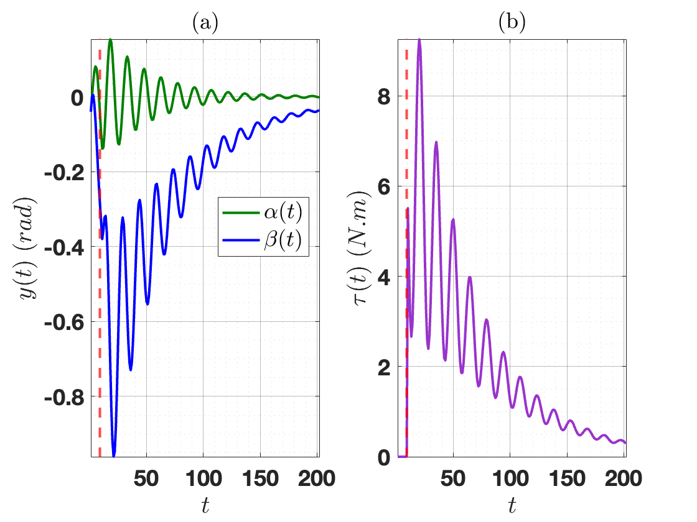
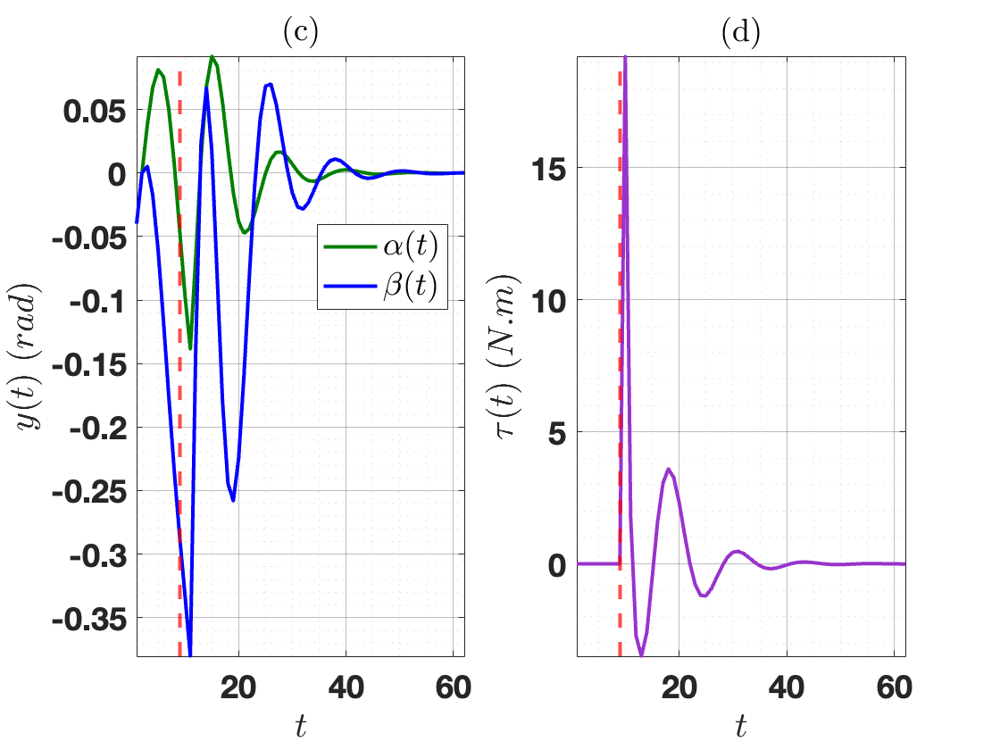

# Physics-informed Learning of Stabilizing Controllers using Noisy Input-Output ARX Models

This project develops physics-informed data-driven methods for verifying the stability of an autonomous system and learning a stable closed-loop system, for linear stochastic input-output systems. A challenge for the latter case is that learning a stable controller requires collecting rich data. When dealing with an open-loop unstable system, however, waiting to collect rich data to learn a stabilizing controller is not a viable option, as the system might reach a catastrophic point that cannot be recovered from. To deal with this challenge, instead of relying only on input-output data, this paper takes an alternative approach by integrating uncertain prior knowledge of the system with possibly non-rich available data. That is, this data might not be rich enough to learn a system model (for indirect learning methods) or directly learn a stabilizing controller (for direct learning methods). The system is represented in an autoregressive exogenous (ARX) form with an input-output format. A link between the ARX model and behavior theory is presented. Using this link, necessary and sufficient conditions for the existence of a physics-informed data-driven dynamic stability condition and stabilizing controller are established using results on a matrix version of Yakubovich's strict lossy \textit{S}-Lemma. A robust dynamic controller is designed by solving linear matrix inequalities. The concept of quadratic difference form is used as a natural framework for Lyapunov functions. The rotary inverted pendulum example, an unstable nonlinear system, is employed throughout the paper to explain the presented method more clearly and showcase the controller's capability through the simulation. An unstable scalar system is also introduced to allow the visualization of the overlap of information sets.

<center>
  <table>
    <tr>
      <td align="center">
        
        <br>
        <em>The overlap of data and physics information sets in a scalar system.</em>
      </td>
      <td align="center">
        
        <br>
        <em>The schematic of a rotary inverted pendulum system.</em>
      </td>
    </tr>
  </table>
</center>

## Installation

### Cloning the Project

Clone the repository to your local machine using:

```bash
git clone https://github.com/NarimanNiknejad/Physics-informed_Stabilizing_Controller_Learning_ARX.git
cd Physics-informed_Stabilizing_Controller_Learning_ARX
```

## Obtaining and Licensing MOSEK 

MOSEK is a powerful optimization solver that can be used with MATLAB to solve various mathematical optimization problems. To get started with MOSEK for MATLAB, follow these steps:

### 1. Download MOSEK

1. Visit the MOSEK download page: [MOSEK Download](https://www.mosek.com/downloads/).

2. Select the appropriate version of MOSEK for your operating system. MOSEK provides versions for Windows, Linux, and macOS.

3. Download the MOSEK installation package.

### 2. Install MOSEK

Follow the installation instructions provided by MOSEK to install the software on your system.

### 3. Obtain a License

1. MOSEK requires a license to use. You can request a free academic license, a trial license, or purchase a commercial license.

2. To request an academic license or a trial license, visit the MOSEK License Request page.

3. Follow the steps on the license request page to obtain your license file. This file will be used to activate MOSEK on your machine.

4. If you decide to purchase a commercial license, contact MOSEK directly through their website for more information on pricing and licensing options.

## License and Contact Info

This project is licensed under the MIT License - see the [LICENSE](LICENSE) file for details. You can customize the parameters and use them for your specific control system applications.

If you have any questions or encounter issues, please feel free to [contact me](mailto:niknejad@msu.edu).

Enjoy exploring and using the code!

## Citation
If you found this page useful for your research, please cite it as:

Submitted to IEEE TNNLS
....

## Results


<center>
  <table>
    <tr>
      <td align="center">
        
        <br>
        <em> Rotary inverted pendulum’s response and control input under the dynamic controller designed
with N = 2 data points and physics.</em>
      </td>
      <td align="center">
        
        <br>
        <em>Rotary inverted pendulum’s response and control input under the dynamic controller designed
with N = 20 data points and physics.</em>
      </td>
    </tr>
  </table>
</center>

