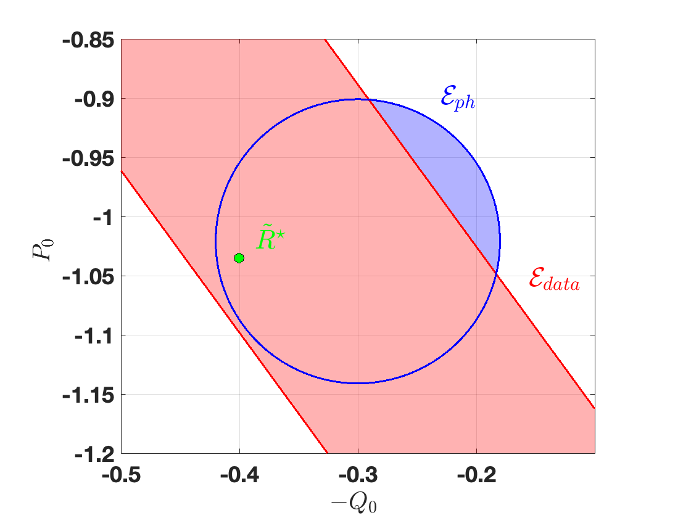

# Physics-Informed Stabilizing Controller Learning with Noisy Input-Output Measurements using ARX Model

This project develops physics-informed data-driven methods for designing a stable closed-loop system for linear input-output systems. A challenge is that learning a stable controller requires collecting rich data. When dealing with an open-loop unstable system, however, waiting to collect rich data to learn a stabilizing controller is not a viable option, as the system can reach a catastrophic point that cannot be recovered from. To deal with this challenge, instead of relying only on input-output data, this paper takes an alternative approach by integrating uncertain prior knowledge of the system with available data which may not be rich enough to identify a system with and is collected before the system reaches an unsafe state that cannot be recovered from. More specifically, for systems represented in an autoregressive exogenous (ARX) form, a dynamic controller is learned by leveraging uncertain physical parameter values and limited noisy and possibly non-rich input-output data measurements over a finite time. The presented approach departs from the current state of data-driven control design that primarily relies on rich input-state data.  Necessary and sufficient conditions for the existence of a physics-informed data-driven dynamic stability condition and stabilizing controller are established using results on a matrix version of Yakubovich's strict lossy ${S}$-Lemma. A robust dynamic controller is designed by solving linear matrix inequalities if such a controller exists. The concept of quadratic difference form is used as a natural framework for Lyapunov functions. The rotary inverted pendulum example is employed throughout the paper to validate the presented method more clearly and showcase the controller's capability. An unstable scalar system is also introduced to allow the visualization of the overlap of information sets.

<center>
  <table>
    <tr>
      <td align="center">
        
        <br>
        <em>The overlap of data and physics information sets in a scalar system.</em>
      </td>
      <td align="center">
        
        <br>
        <em>The schematic of a rotary inverted pendulum system.</em>
      </td>
    </tr>
  </table>
</center>

## Installation

### Cloning the Project

First, clone the repository to your local machine:

```bash
git clone https://github.com/NarimanNiknejad/Physics-informed_Stabilizing_Controller_Learning_ARX.git
cd SODA-RRT
```

