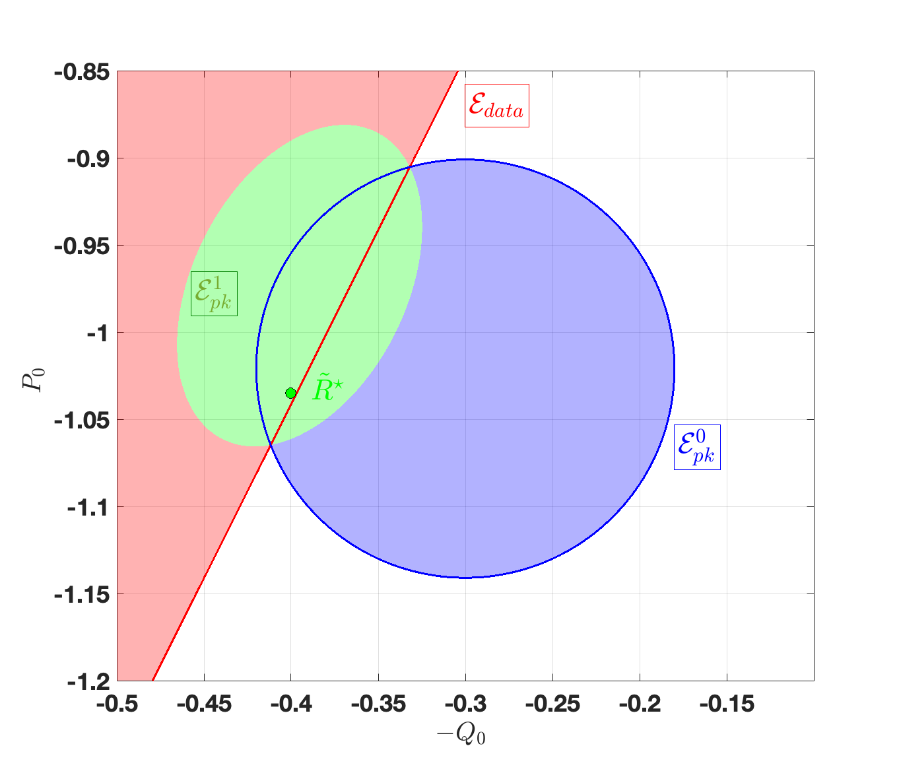
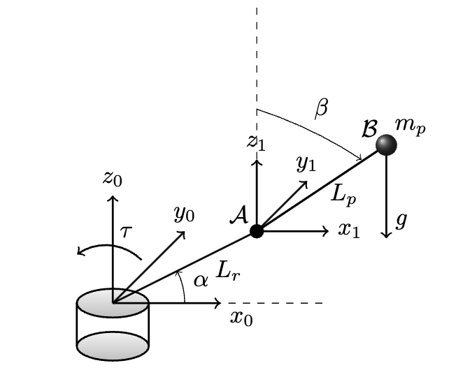

# Online Learning of Stabilizing Controllers using Noisy Input-Output Data and Prior Knowledge

### Cloning the Project

Clone the repository to your local machine using:

```bash
git https://github.com/NarimanNiknejad/Ph-Learning-ARX.git
cd Ph-Learning-ARX
```

## Obtaining and Licensing MOSEK 

MOSEK is a powerful optimization solver that can be used with MATLAB to solve various mathematical optimization problems. To get started with MOSEK for MATLAB, follow these steps:

### 1. Download MOSEK

1. Visit the MOSEK download page: [MOSEK Download](https://www.mosek.com/downloads/).

2. Select the appropriate version of MOSEK for your operating system. MOSEK provides versions for Windows, Linux, and macOS.

3. Download the MOSEK installation package.

### 2. Install MOSEK

Follow the installation instructions provided by MOSEK to install the software on your system.

### 3. Obtain a License

1. MOSEK requires a license to use. You can request a free academic license, a trial license, or purchase a commercial license.

2. To request an academic license or a trial license, visit the MOSEK License Request page.

3. Follow the steps on the license request page to obtain your license file. This file will be used to activate MOSEK on your machine.

4. If you decide to purchase a commercial license, contact MOSEK directly through their website for more information on pricing and licensing options.

   <center>
  <table>
    <tr>
      <td align="center">
        
        <br>
        <em>The overlap of data and physics information sets in a scalar system.</em>
      </td>
      <td align="center">
        
        <br>
        <em>The schematic of a rotary inverted pendulum system.</em>
      </td>
    </tr>
  </table>
</center>


## License and Contact Info

This project is licensed under the MIT License - see the [LICENSE](LICENSE) file for details. You can customize the parameters and use them for your specific control system applications.

If you have any questions or encounter issues, please feel free to [contact me](mailto:niknejad@msu.edu).

Enjoy exploring and using the code!

## Citation
If you found this page useful for your research, please cite it as:

Accepted by IEEE Open Journal of Control Systems and waiting for the citation information...
....


